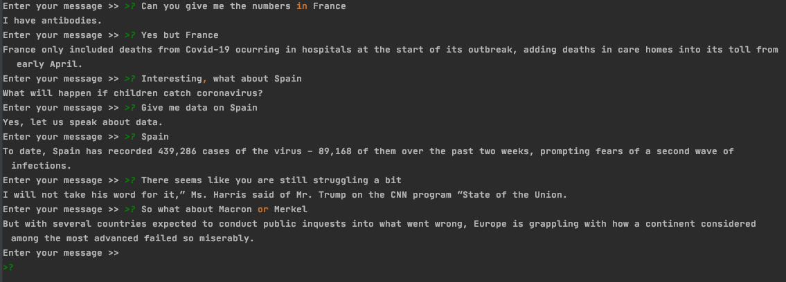

***`COVIDBot`*** scraps institutional and news website such as the nytimes, the guardian, the bbc or the CDC, and provides an AIML chatbot based on the content retrieved.

To install:
```sh
$ sudo apt install python3-pip
$ sudo apt-get install python3-venv
$ python3 -m venv venv
$ source ./venv/bin/activate
$ pip3 install -r requirements.txt
# Make sure last Chrome is installed, not chromium but chrome
```
---
To Launch, nothing easier, just run. If files have never been built, the process will be long.
The version available here on GitHub has everything built but the botbrain. Depending on the memory
available on your computer, you might have to adjust the memlim parameter. Indeed, if you don't have enough
swap, the OS might kill the process.
```sh
$ ./covid_bot.py
```
You can alternatively, scrap new data and rebuild the bot or relaunch the AIML building process at any of the important stages.
Just be aware that modifying a previous building stage will force a rebuild of the following ones.

---
### Here are the build options:

```sh
--build or -b
```
*with:*
1. `all`: Goes through all the stages of building the bot. Equivalent in practice to
`scrap`
2. `corefseg`: Used initially to resolve the coreferences within the corpus, but results were not satisfactory. I therefore decided to leave the coreferences unresolved. This stage still segments the articles in multiple smaller parts that are easier to work with, and remove overused or flagged sentences as well as the duplicates. This is a particularly slow building process.
3. `model`: Build the models that are used to determine whether or not an entry is COVID related.
4. `covidentries`: Extract COVID related entries depending on model used (Logistic Regression or SVM).
5. `covidtopics`: Extract COVID themes with TF-IDF and KMeans.
6. `botbrain`: Build the AIML code.
---
```sh
--model or -m
```
*with:*
1. `SVM`: Uses Support Vector Machine to extract COVID related entries (default, slower but more accurate).
2. `logreg`: Uses Logistic Regression to extract COVID related entries.
---
```sh
--labeling or -l
```
*with:*
1. `Int`: Will export a file based on the scrapped entry with the number of entries to label passed as an option. Open the xml file created and label the entries related or not to covid with the strings `covid` and `not covid`. The program will use this file for classification.

    ! Be careful, this will overwrite any existing file used for labeling.
---
```sh
--memlim or -e
```
*with:*
1. `Int`: The AIML is loaded in memory and the more the data, the more likely the bot will not load and the process will be killed. The default is `1`. Try a higher number until the process loads on your system. If the process got killed in the middle of writing the botbrain, make sure you delete the file in `data_saved` or call the bot with the option `-b botbrain`

---
#### Roadmap - closed issues:

    done - Get rid of jobs announcement subdomains
    done - Filter better remaining html tags, css inlining
    done - Save date -- This ensures that stale links gradually disappears
    done - Make sure than there is at least one element on the page or more than a certain amount of characters.
    done - Scrapper
        done - a - Understand why rules won't work and the filter is not applied
            done - # - regex preparsing relative path, not absolute
        done - b - Bread-width-first (see settings file)
        done - c - Kill all queued requests (might not be relevant anymore since I'm not following requests)
        done - d - Extract date for each article
        done - e - Limit scrapping to what is past three months

    done - Coreference extraction
    done - Text Segmentation
    done - Automatize to get a small corpus to label
    done - Label data
    done - TF-IDF with Logistic Regression or SVM to isolate COVID - Labeled data 500
    done - TF-IDF then K-Means clustering on all corpus to get terms out
    done - Get topic name by the most used terms per cluster
    done - Generate one aiml file per topic
    done - Review structure of dictionnary for mapping
    done - Understand why one topic is not in the cluster list
    done - Add non-topics to bot
    done - Add Random Tag To centralize cue and Entities pattern as shown below
    done - Better way to find patterns(single nouns and no verbs?)
    done - Bring permutations within one loop and test code
    done - Save Brain of Chatbot
    done - Allow parameters to be passed to cmd line to isolate the different type of actions possible
        done - a - Scrap only the web
        done - b - Export Data for labelling
        done - c - Load - done
        done - d - Pass type model to recognize covid text
        done - f - generate aiml
        done - g - launch bot
        done - h - start-from-scratch
        done - i - save model
        done - j - load model

    done - Install locally webdriver / Check that the path works
    done - Rules for automatic path to driver
    done - Make Driver Path absolute
    done - Prepare proper packaging
    done - Paths must be resolved properly
    done - Make sure it can be deployed and built anywhere
        done - a - Check all Packages
        done - b - Check Environment - Envpath
    done - Add quit option to AIML
    done - Test env on linux
    done - On Scrapper, writing to files need to be invoked only once
    done - Refactor all the code
    done - Silence nltk downloads
    done - Comment Code - done
    done - Better strategy in generating AIML
    done - Bring In A different strategy for extracting facts, one subject, one verb, all other noun_chunks that are objs
    done - Get rid of textacy
    done - Add also topic data to non-topic files
    done - Contractions and lemmatization on input
---
#### Roadmap - open issues:
    #TODO - Add an example image to README
    #TODO - Comment export_aiml
    #TODO - 1 -  Survey where data structures can be replaced by Pandas DataFrame
    #TODO - 2 - Develop Mecanism to flag answer when special authorized user is interacting with the bot
        # - 2 - a - Need to be able to blacklist entry - (Put it in a dic, and rebuild AIML)
    #TODO - 3 - PIPE NLP when processing batches of docs for incredible speed bump
    #TODO - 4 - Cron Job to scrap and rebuild automatically the bot
    #TODO - 5 - Survey better clustering techniques
    #TODO - 6 - Unit Testing
    #TODO - 7 - Linting
    #TODO - 8 - Word embeddings all across would have been more efficient than TF-IDF?
    #TODO - 9 - Investigate better Scrapping
        # - 9 - a - Stupid meaningless sentences get kept
        # - 9 - c - Investigate Paywall for NYT, do I need a new Login?
    #TODO - 10 - Label more Data for better SVM accuracy
---
### Remarks:

I initially used AIML as the knowledge base for the bot but I mostly use it as a simple pattern matcher. It might have been cleverer to simply use some internal pattern matching for the bot instead of bloating files and working around AIML to generate the COVIDBot.